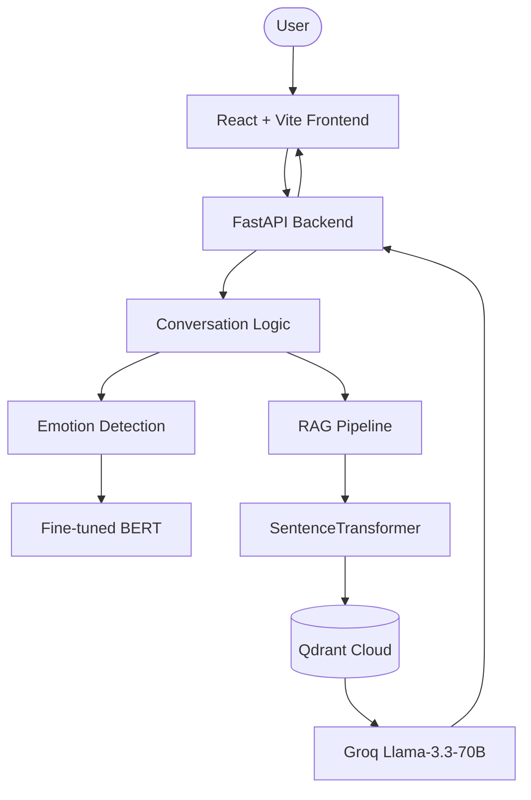

# 📚 ForkLens — Literary Wisdom for Life's Crossroads

**ForkLens** is an AI-powered conversational counselor that provides empathetic guidance through the lens of classic literature. 

When you share your emotional situations or dilemmas, ForkLens doesn't just give advice; it finds specific literary characters who faced similar crossroads and shares their stories — choices made, paths taken, and lessons learned.

---

## ✨ Features

- **🎭 Emotional Resonance**: Real-time heartbeat of your conversation. A custom-mapped "Emotional Mirror" reflects your detected fine-grained emotions back to you as you speak.
- **✨ Premium Landing Page**: A cinematic, gold-glow threshold that welcomes you into a space of stillness and reflection.
- **📖 Literary RAG**: Searches a vector database of **4,600+** emotion-labeled literary passages from Project Gutenberg's classics.
- **🛤️ Journey Mapping**: Identifies characters, their choices, and the outcomes to help illuminate your own path.
- **🍂 Fallback Intelligence**: Smarter-than-average fallback mode that provides general literary wisdom even when the database is unreachable.
- **💬 Glassmorphism UI**: A high-end, responsive React interface featuring atmospheric noise textures and sophisticated typography.

---

## 🏗️ Architecture

ForkLens is built with a modern decoupled stack, ensuring performance, scalability, and a premium user experience.



### Core Components
- **Frontend**: React (Vite) + Tailwind CSS + Framer Motion for a fluid, cinematic experience.
- **Backend**: FastAPI (Python) handles the orchestration of LLM calls, RAG, and emotion detection.
- **Expertise**: Locally fine-tuned BERT for ultra-precise emotion mapping.

---

## 🚀 Quick Start

### 1. Prerequisites
- Python 3.10+
- Node.js & npm
- Groq API Key
- HuggingFace API Token
- Qdrant Cloud Cluster (or local instance)

### 2. Installation

#### Backend Setup
```bash
# Clone and enter
git clone <repo-url>
cd phase2

# Setup environment
python -m venv venv
source venv/bin/activate  # Windows: venv\Scripts\activate
pip install -r requirements.txt
```

#### Frontend Setup
```bash
cd frontend
npm install
```

### 3. Configuration (`.env`)
Create a `.env` file in the root directory.

```ini
GROQ_API_KEY=gsk_...
HF_TOKEN=hf_...
QDRANT_HOST=...
QDRANT_API_KEY=...
LLM_MODEL=llama-3.3-70b-versatile
JUDGE_MODEL=llama-3.3-70b-versatile
EMOTION_MODEL_PATH=./final_models/emotion_model
```

### 4. Launch

#### Start the Backend (Port 8000)
```bash
# From project root
python3 server.py
```

#### Start the Frontend (Port 5173)
```bash
# From frontend directory
npm run dev
```

---

## 🔧 Customization

You can freely swap models without touching the code by updating your `.env` file:

- **LLM**: Change `LLM_MODEL` (e.g., to `llama-3.1-8b-instant` on Groq).
- **Judge Model**: Update `JUDGE_MODEL` to seamlessly swap the LLM-as-a-Judge backend (Groq recommended).
- **Embeddings**: Change `EMBED_MODEL` (requires re-indexing your data in Qdrant).
- **Emotion**: Update `EMOTION_MODEL_PATH` to point to a different local directory.

---

## 📄 License
MIT License. See [LICENSE](LICENSE) for details.

**ForkLens** — *Where literature meets life.* 📚✨